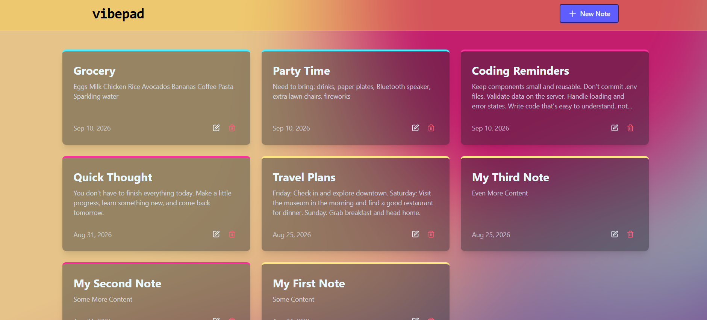
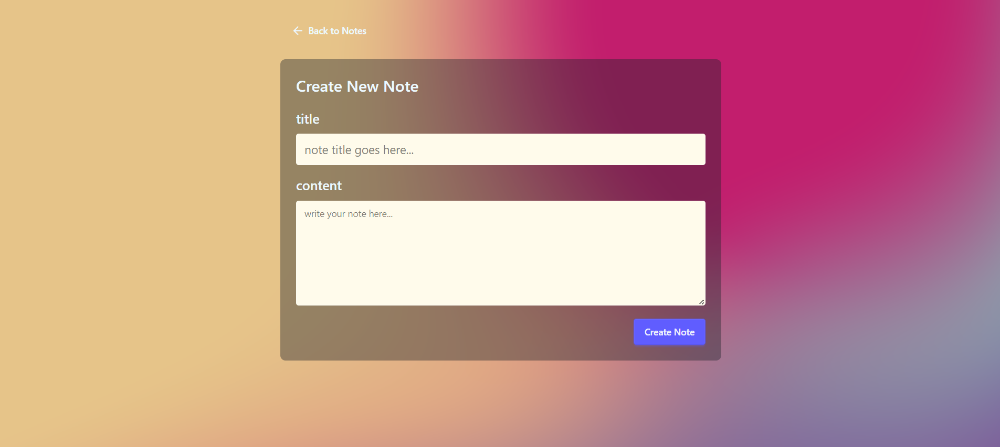
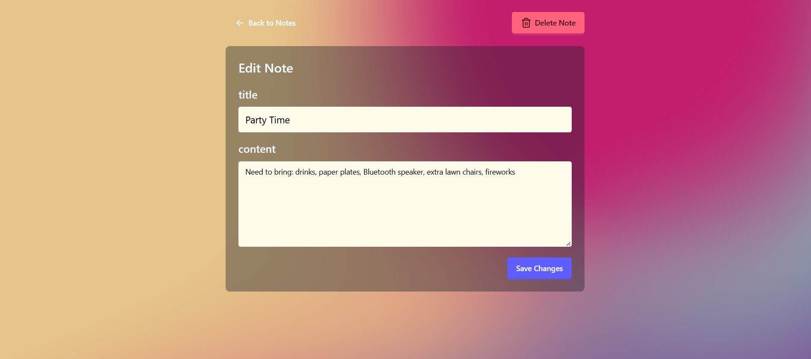
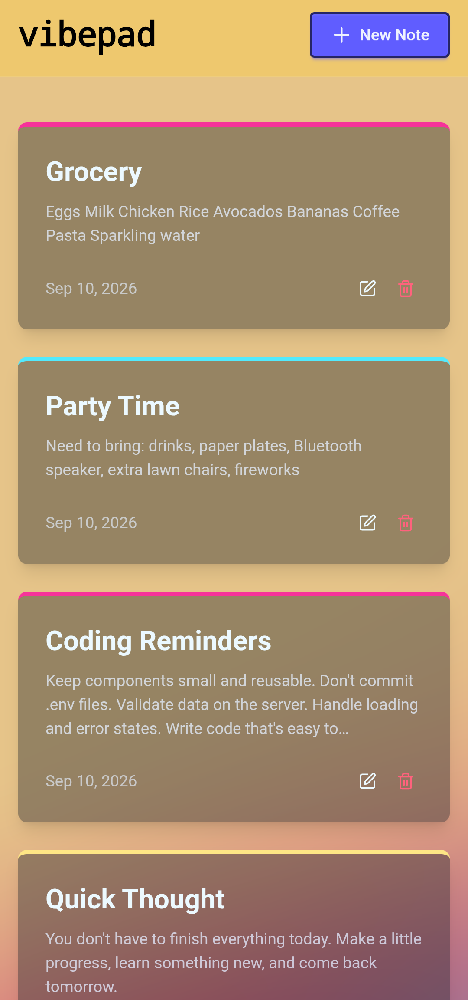

# vibepad

A full-stack notes application built with the **MERN stack** — MongoDB, Express, React, and Node.js.



### 🚀 Live Demo

You can view the project here:
**[View vibepad](https://mern-notepad-3bw1.onrender.com/)**

vibepad allows users to create, view, edit, and delete notes through a React frontend connected to a REST API.

> **Note:** I completed this project by following this tutorial: [MERN ThinkBoard GitHub](https://github.com/burakorkmez/mern-thinkboard) [Youtube Video](https://www.youtube.com/watch?v=F9gB5b4jgOI). However, I made updates to the user interface and implemented it using current package versions.

## ✨ Features

* Create notes
* View notes
* Edit notes
* Delete notes
* Loading states
* Error handling with toast notifications
* API rate limiting
* Responsive UI

## 🛠️ Technologies & Tools

### Frontend

* **React** — Frontend UI
* **React Router** — Client-side routing
* **Axios** — HTTP requests to the backend API
* **Tailwind CSS** — Styling
* **DaisyUI** — UI components built with Tailwind CSS
* **Lucide React** — Icons
* **React Hot Toast** — Toast notifications
* **Vite (with Oxlint)** — Frontend development and build tooling

### Backend

* **Node.js** — JavaScript runtime
* **Express** — Backend server and REST API routes
* **Mongoose** — Connecting to MongoDB
* **MongoDB** — Database
* **CORS** — Accepting requests from a different origin
* **dotenv** — Environment variable management
* **Upstash Redis** — Track the number of user requests
* **Upstash Ratelimit** — API rate limiting
* **Nodemon** — Backend development tooling

## 💻 Running Locally

### 1. Clone the repository

```bash
git clone <your-repository-url>
cd <your-project-folder>
```

### 2. Configure environment variables

Create a `.env` file inside the `backend` directory with the following:

```env
MONGO_URI=<your_mongo_uri>

PORT=<your_port>

UPSTASH_REDIS_REST_URL=<your_redis_rest_url>
UPSTASH_REDIS_REST_TOKEN=<your_redis_rest_token>

NODE_ENV=development
```

### 3. Start the backend

```bash
cd backend
npm install
npm run dev
```

### 4. Start the frontend

In a second terminal:

```bash
cd frontend
npm install
npm run dev
```

The frontend will then be available at the local URL provided by Vite.

## 📡 API Endpoints

| Method   | Endpoint         | Description       |
| -------- | ---------------- | ----------------- |
| `GET`    | `/api/notes`     | Get all notes     |
| `GET`    | `/api/notes/:id` | Get a single note |
| `POST`   | `/api/notes`     | Create a note     |
| `PUT`    | `/api/notes/:id` | Update a note     |
| `DELETE` | `/api/notes/:id` | Delete a note     |

## 📚 Project Background

I wanted to refresh my coding skills and get back into full-stack development, and what better way to start than with a classic notepad application? vibepad was built to practice building a REST API, connecting a React frontend to a Node.js/Express backend, working with MongoDB, creating middleware, and implementing API rate limiting with Upstash.

## 📸 Screenshots

### Creating a Note



### Editing a Note



### Mobile Design

